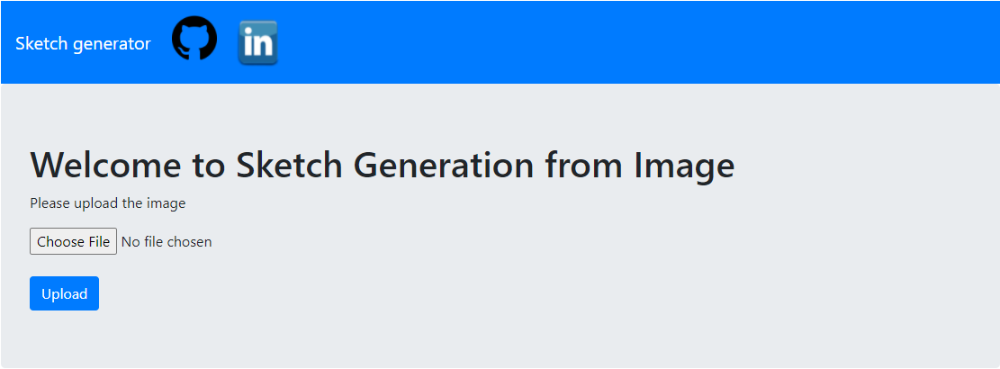
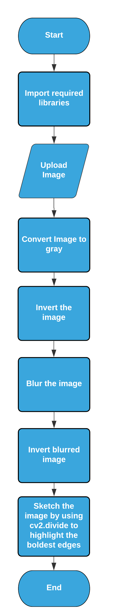

# UCS757 : Building Innovative Systems
# PROJECT 3 : Sketch Generator
## Introduction :
This project uses a Deep Neural Network, more specifically a Convolutional Neural Network, to differentiate between images of people with and without masks. The CNN manages to get an accuracy of 98.2% on the training set and 97.3% on the test set. Then the stored weights of this CNN are used to classify as mask or no mask.

I have trained the model already and i am using the HDF5 file to store the model weights , if you want to train the model please use trainmodel.py file and download the data from the link given below.

## Requirements : 
OpenCV
## Dataset Source :
https://data-flair.training/blogs/download-face-mask-data/

## Live Link :
https://vishal-sketch-generator.herokuapp.com/

## Input Interface :

## Input Image :

## Output :

## Flowchart : 

## Submitted by :- 
### Vishal Gulati
### 101803152
### COE8
